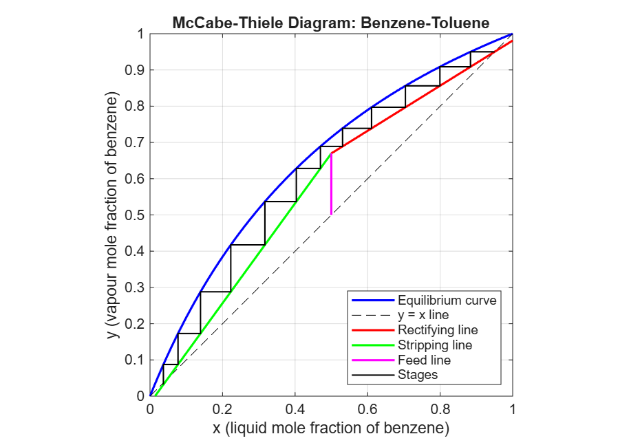

# Distillation-McCabe-Thiele
MATLAB design of a benzene-toluene distillation column using the McCabe-Thiele method

# McCabe-Thiele Distillation Column Design: Benzene-Toluene (MATLAB)

## Objective
Design a binary distillation column in MATLAB using the McCabe-Thiele method and find the number of theoretical stages needed for the required separation.

## Design Specifications
- Mixture: benzene-toluene, constant relative volatility (alpha = 2.5)
- Feed: 50 mol% benzene, saturated liquid
- Top product: 95 mol% benzene
- Bottom product: 5 mol% benzene
- Reflux ratio: 1.5 times the minimum reflux ratio

## Method
1. Drew the equilibrium curve from the relative volatility.
2. Calculated the minimum reflux ratio from the feed line and the equilibrium curve.
3. Plotted the rectifying line, stripping line and feed line.
4. Stepped off the stages from the top product to the bottom product.
5. Repeated the calculation at different reflux ratios.

## Results
- Minimum reflux ratio: 1.10
- Operating reflux ratio: 1.65
- Number of theoretical stages: 12 (including the reboiler)
- Optimum feed stage: 6

### Effect of reflux ratio

| R / Rmin | R | Stages |
|---|---|---|
| 1.2 | 1.32 | 15 |
| 1.5 | 1.65 | 12 |
| 2.0 | 2.20 | 10 |
| 3.0 | 3.30 | 9 |

Higher reflux needs fewer stages but more reboiler and condenser energy, and the saving in stages gets smaller each time.

## Plot

## How to Run
Open `mccabe_thiele.m` in MATLAB and click Run.

## Author
Roshni
